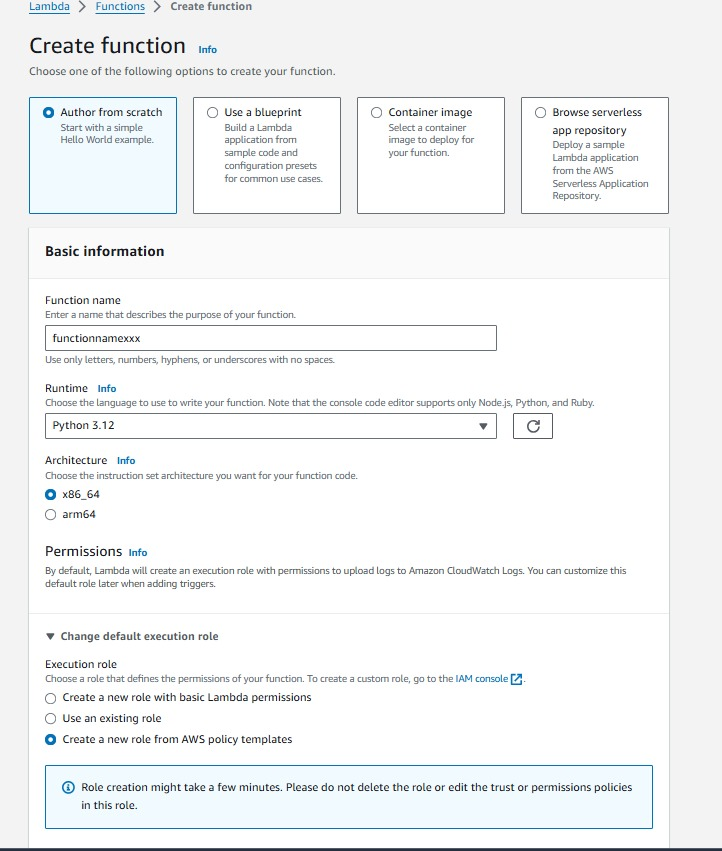
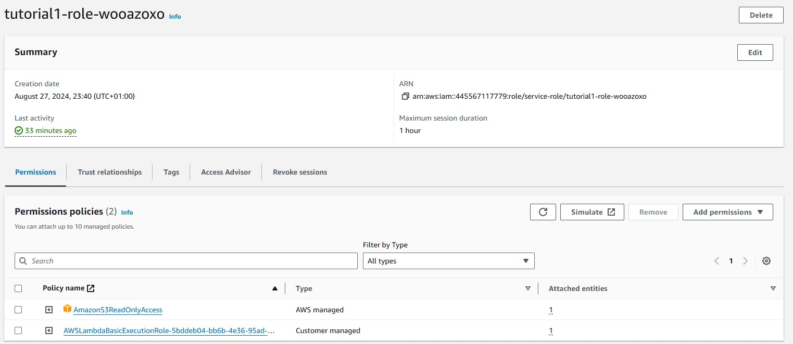
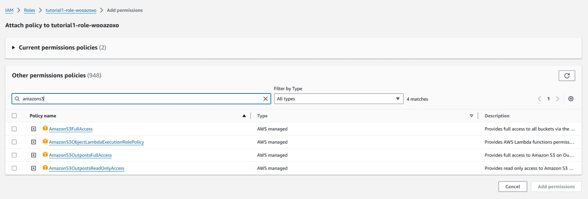
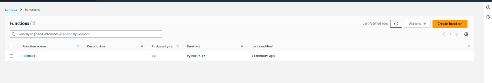
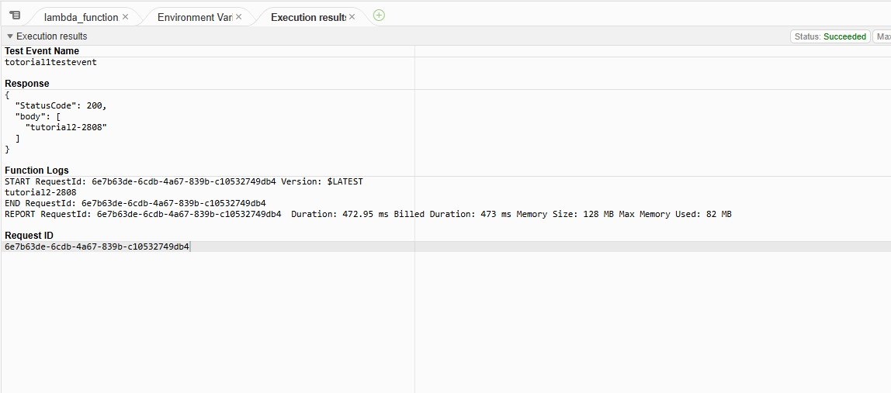
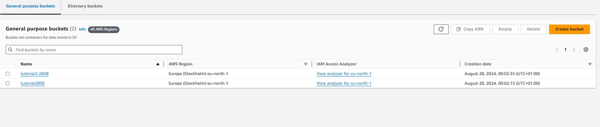

#1. AWS Lambda S3 Bucket Listing Tutorial

This tutorial guides you through the process of creating an AWS Lambda function that lists all your S3 buckets.

## Prerequisites

- AWS Account
- Basic knowledge of AWS Lambda and S3
- AWS CLI installed and configured
- Access to AWS Management Console

## Steps

### Step 1: Create a Lambda Function

First, navigate to the AWS Lambda console and create a new Lambda function.

### Step 2: Configure IAM Permissions

Ensure your Lambda function has the necessary IAM permissions to access S3.

### Step 3: Create the Lambda Role

You will need to create a role that includes permissions for S3 access.

### Step 4: Add Your Code

Add your Python code to list S3 buckets.

### Step 5: Execute the Function

After setting everything up, execute your Lambda function.

### Step 6: View S3 Buckets

Check the S3 buckets to see if the function has listed them correctly.

